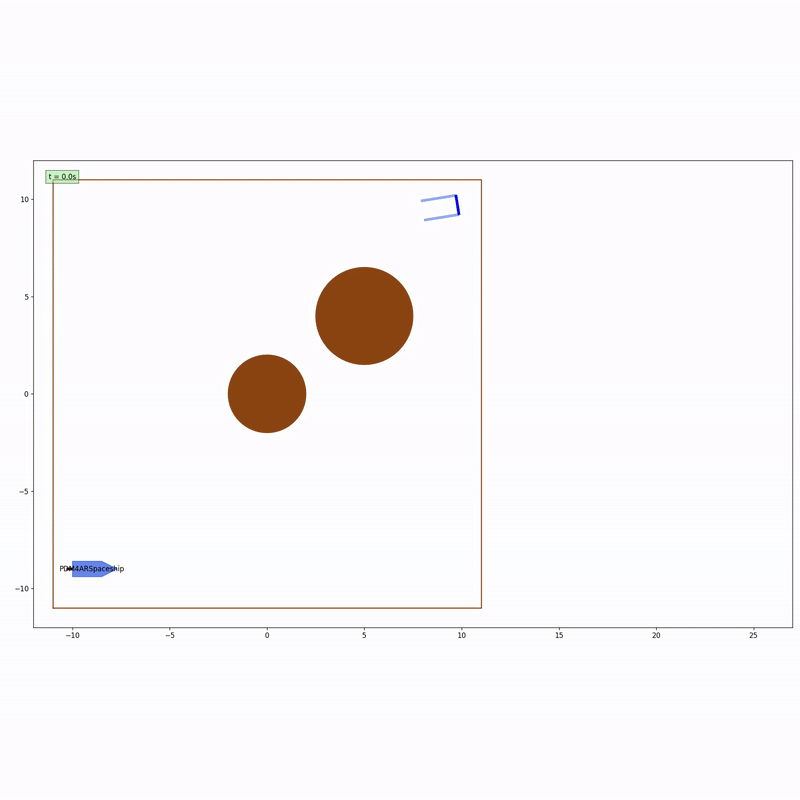

## Problem Request & Approach
**Request:**  
The task was to develop a complete planning stack for the spaceship agent that operates in closed-loop with a simulator. At each simulation step, the agent receives observations (including its own state and that of obstacles) and must output appropriate actuation commands. Key challenges include:
- **Path Planning:** Determining a safe and efficient trajectory to avoid obstacles such as planets and satellites.
- **Dynamic Constraints:** Respecting the spaceship's dynamics, including limited thrust, restricted thruster angles, and physical constraints like fuel usage and mass limits.
- **Integration:** Maintaining the existing Agent interface so that the planner works seamlessly with the simulator.

**Approach:**  
To solve the problem, we experimented with a sequential convexification (SCvx) approach – a method inspired by techniques used in advanced aerospace applications. This allowed us to:
- Linearize the nonlinear spaceship dynamics around a reference trajectory.
- Iteratively optimize the trajectory while satisfying various constraints (initial/final state, collision avoidance, and control limits).
- Evaluate the quality of the solution based on efficiency, fuel consumption, and safety metrics.

## Demonstration
Below are two key visualizations from the project. The videos illustrate two important scenarios:
- **Planetary Navigation:** Avoiding fixed obstacles (planets) while reaching the goal.
- **Satellite Avoidance:** Navigating around moving satellites.

<table>
  <tr>
    <td align="center"><strong>Planetary Navigation</strong></td>
    <td align="center"><strong>Satellite Avoidance</strong></td>
  </tr>
  <tr>
    <td align="center">
      
    </td>
    <td align="center">
      
    </td>
  </tr>
</table>
